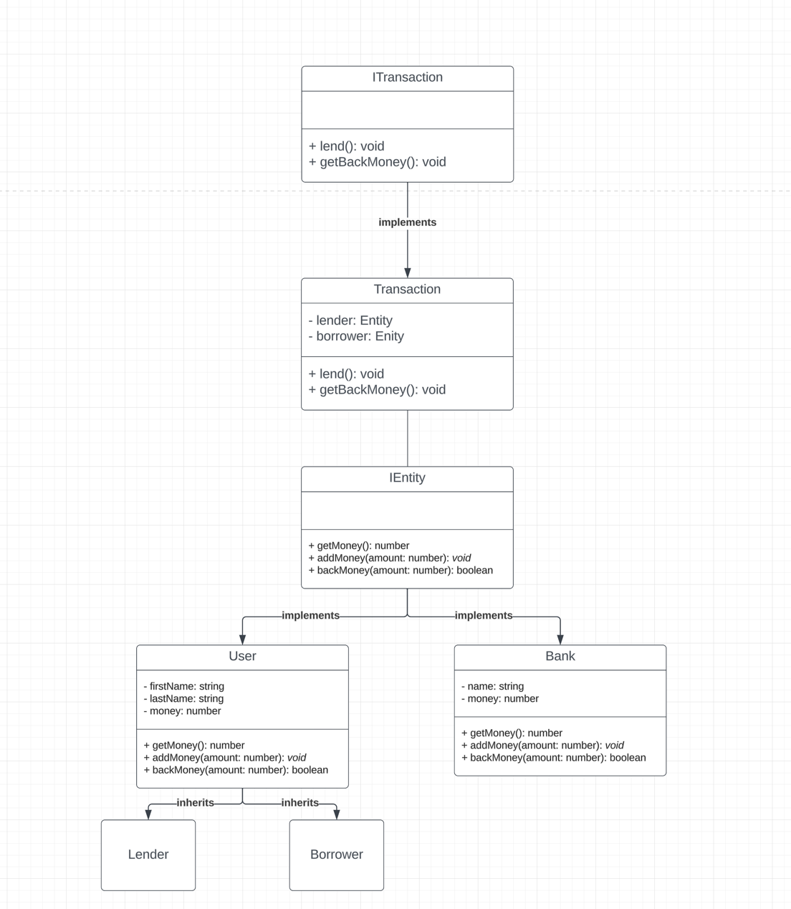

## Run demo
```bash
node index.js
```

## SOLID Principles
1. Single Responsibility Principle (SRP):
The `User` handles user-related operations, `Bank` deals with bank operations, and `Transaction` manages financial transactions.
2. Open/Closed Principle (OCP):
It could easily extend the `User` class to create specific types of users (like `Lender` and `Borrower`) without modifying the `User` class itself.
3. Liskov Substitution Principle (LSP):
The `Lender` and `Borrower` can be substituted for `User` wherever a `User` is expected. Similarly, any class implementing `IEntity` can be used interchangeably.
4. Interface Segregation Principle (ISP):
The `IEntity` interface is a minimal interface that `User` and `Bank` can easily implement.
5. Dependency Inversion Principle (DIP):
The `Transaction` class currently directly depends on concrete implementations of `IEntity`.

## OOP Principles
1. Encapsulation:
   Fields in `User`, `Bank`, and `Transaction` are private.
2. Abstraction:
   Interfaces `IEntity` abstract common behaviors.
3. Inheritance:
   `Lender` and `Borrower` inherit from `User`.
4. Polymorphism:
   `Transaction` can work with any entities that implement the `IEntity` interface.

## Class Diagram


## Thank you
- Thanks for reading.
- I may not describe the document well, but I'm confident in my technique.
- I would like to show you my projects. I promise to support the company, and I'm sure you will like it.

